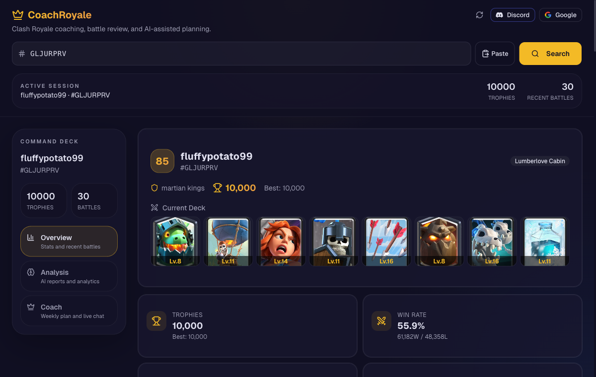

# CoachRoyale

**AI-native Clash Royale coaching — player analytics, battle review, and a coaching assistant, served from the edge.**

[](https://coach-royale.com)
[](#tech-stack)
[](#tech-stack)
[](#tech-stack)

> **▶ Live demo: [coach-royale.com](https://coach-royale.com)** — no signup required. Paste any Clash Royale player tag (e.g. `GLJURPRV`) and explore the full stats + battle-review surface instantly.



---

## What it is

CoachRoyale turns a Clash Royale player tag into a full coaching surface. It pulls live data from Supercell's API, computes deterministic performance analytics (win rates, matchup tendencies, tilt detection, time-of-day performance), and layers an AI coach on top for natural-language analysis and weekly improvement plans.

It's built as a **backend-for-frontend (BFF) on Cloudflare's edge**: a static React SPA talks to a single Cloudflare Worker that owns all application logic, with a deliberately tiny relay as the only always-on server.

### Features

- **Instant player lookup** — search any tag, no account needed.
- **Overview** — profile, current deck (with card levels), clan, trophy progression, win/loss, and the last 30 battles with opponents' decks and results.
- **Analytics** — win-rate trends, best/worst decks, matchup strengths, tilt impact, and best/worst time-of-day slots, computed deterministically from battle history.
- **AI coaching** — a multi-lane model router serves natural-language analysis and weekly plans (Cloudflare Workers AI for the free tier, Claude for Pro, or bring-your-own-key straight from the browser).
- **Accounts & sync** *(optional)* — Google / Discord sign-in via Supabase unlocks tracked players, saved analysis history, and AI usage quotas, all protected by row-level security.
- **Privacy by design** — server-side data export and account erasure; BYOK provider keys never leave the browser.

---

## Architecture

A static SPA, one edge Worker that owns the product logic, and a minimal static-IP relay that exists solely to satisfy Supercell's IP allowlist.

```
Browser (React SPA, Cloudflare Pages)
        │  HTTPS
        ▼
Cloudflare Worker  (Hono BFF — coach-royale.com/api/*)
        ├──► Supabase Postgres   (user data, RLS, auth)
        ├──► AI lane router       (Workers AI · Claude · BYOK · self-hosted)
        ├──► Lemon Squeezy        (billing / Pro upgrades)
        └──► Relay (FastAPI, static IP) ──► Supercell Clash Royale API
```

**Why the relay?** Supercell binds each API token to a fixed IP allowlist, which rules out serverless egress. The relay is the *only* always-on server in the system — a tiny shared-secret-authenticated FastAPI proxy whose sole job is to reach Supercell from a stable IP. All product logic stays in the Worker.

A fuller treatment — trust boundaries, AI-lane routing, and an AWS-style layered diagram — lives in [`docs/architecture/`](docs/architecture/).


---

## Tech stack

| Layer | Stack |
| --- | --- |
| **Web** (`apps/web`) | React 19, TypeScript (strict), Vite, Tailwind CSS, shadcn/ui, Zod 4, Vitest + Testing Library |
| **API** (`apps/api-worker`) | Cloudflare Workers, Hono, TypeScript, Zod 3, Vitest, Wrangler |
| **Relay** (`apps/relay`) | Python 3, FastAPI, httpx, Pydantic, Uvicorn |
| **Data / Auth** | Supabase (Postgres + Row-Level Security + Auth), 7 SQL migrations |
| **AI** | Cloudflare Workers AI · Anthropic Claude · BYOK (browser→provider) · optional self-hosted fine-tune |
| **Billing** | Lemon Squeezy |
| **Platform** | Cloudflare Pages + Workers + AI Gateway; CI/CD via GitHub Actions |

---

## Repository layout

```
apps/
  web/         React 19 SPA  → Cloudflare Pages
  api-worker/  Hono BFF      → Cloudflare Worker (sync, AI, billing, user data)
  relay/       FastAPI proxy → static-IP host (Supercell access only)
supabase/
  migrations/  Postgres schema + RLS policies (001–007)
docs/
  architecture/  diagrams, model-routing, layered architecture
  deployment/    Cloudflare deploy guide
  security/      CSP baseline
.github/workflows/  path-filtered CI: lint, typecheck, test, build per surface
```

---

## Engineering highlights

- **Edge-first BFF.** All product logic lives in one Cloudflare Worker (Hono); the browser only ever talks to `/api/*` on the same origin. No cold-start backend to maintain.
- **One load-bearing server, by design.** The static-IP requirement is isolated into a small relay, so the rest of the system stays serverless.
- **Validated trust boundaries.** Every external payload (Supercell responses, request bodies, webhooks) is parsed with Zod / Pydantic before it's trusted — the app degrades gracefully when an upstream API drifts.
- **Multi-lane AI routing.** A single coaching interface routes to Workers AI, Claude, a user's own key, or a self-hosted fine-tune, with a deterministic analytics fallback when AI is unavailable.
- **Security posture.** Strict CSP, Supabase row-level security, secrets scoped per trust boundary (the Supercell token never leaves the relay; the service-role key never leaves the Worker), and a committed secret scanner.
- **CI/CD.** GitHub Actions runs path-filtered lint / typecheck / test / build per surface and gates deploys.

---

## Running locally

**Prerequisites:** Node 20, Python 3.12+. Copy `apps/web/.env.example` → `apps/web/.env.local` and add your Supabase keys.

```bash
# Web SPA  ->  http://localhost:5173
npm --prefix apps/web install
npm --prefix apps/web run dev

# API Worker  ->  http://localhost:8787
npm --prefix apps/api-worker install
npm --prefix apps/api-worker run dev

# Relay (Supercell proxy)
python3 -m venv .venv && .venv/bin/pip install -r apps/relay/requirements.txt
.venv/bin/uvicorn app.main:app --app-dir apps/relay --reload
```

Tests:

```bash
npm --prefix apps/web run test
npm --prefix apps/api-worker run test
(cd apps/relay && ../../.venv/bin/pytest -q)
```

Production deployment (Cloudflare Pages + Worker + relay) is documented in [`docs/deployment/`](docs/deployment/).

---

## Screenshots

| Search | Overview |
| --- | --- |
|  |  |

---

<sub>Clash Royale is a trademark of Supercell. This is an independent fan project and is not affiliated with or endorsed by Supercell.</sub>
