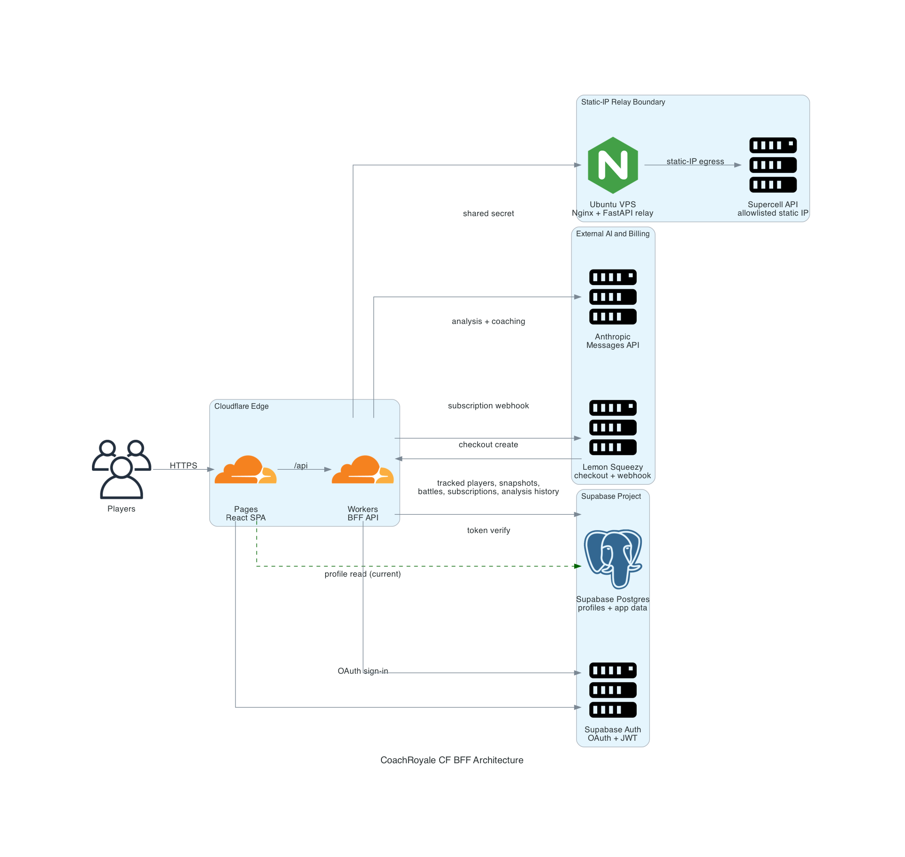

# CoachRoyale CF BFF Architecture

This diagram documents the current implementation that lives in `apps/web`, `apps/api-worker`, `apps/relay`, and `supabase`.

Rendered diagram:

Related design:

- Product flowgram: [coachroyale-flowgram.md](coachroyale-flowgram.md) — static workflow PNG: [generated-diagrams/coachroyale-flowgram-workflow-static.png](generated-diagrams/coachroyale-flowgram-workflow-static.png), labeled workflow PNG: [generated-diagrams/coachroyale-flowgram-workflow-labeled.png](generated-diagrams/coachroyale-flowgram-workflow-labeled.png), review PNG: [generated-diagrams/coachroyale-flowgram-review.png](generated-diagrams/coachroyale-flowgram-review.png), full PNG: [generated-diagrams/coachroyale-flowgram-master.png](generated-diagrams/coachroyale-flowgram-master.png)
- AI lane routing: [model-routing.md](model-routing.md)
- Code-derived audit (kept in sync with `apps/*` source): [code-derived-architecture-audit-2026-05.md](code-derived-architecture-audit-2026-05.md)
- AWS-style layers, flows, and **module inventory**: [layered-architecture-aws-aligned.md](layered-architecture-aws-aligned.md) — **draw.io (editable):** [diagrams/coachroyale-architecture.drawio](diagrams/coachroyale-architecture.drawio) — **colored HTML:** [diagrams/layered-architecture-colored.html](diagrams/layered-architecture-colored.html) — Mermaid: [diagrams/layered-architecture-preview.html](diagrams/layered-architecture-preview.html)

## Diagram approach

The layout follows AWS reference diagram conventions rather than ad hoc box-and-arrow sketching:

- single-page, left-to-right flow
- modular tiers
- high-level abstraction instead of code-level noise
- current icon sets where vendor icons exist

Because this workload is not deployed on AWS, the diagram adapts AWS diagramming conventions to Cloudflare, Supabase, Anthropic, Lemon Squeezy, and a VPS relay.

## Runtime flow

1. Players load the React SPA from Cloudflare Pages.
2. The SPA calls the Cloudflare Worker BFF for core product APIs.
3. The Worker verifies user tokens with Supabase Auth and persists application data in Supabase Postgres.
4. The Worker calls Anthropic for AI features and Lemon Squeezy for billing.
5. The Worker reaches the Supercell API only through the Ubuntu VPS relay so the Supercell traffic originates from the allowlisted static IP.

## AI lane overview

The recommended product routing model is:

- `free` -> Cloudflare Workers AI through AI Gateway for authenticated free users; deterministic preview for anonymous users
- `sft` -> garage-hosted fine-tuned model behind the Worker
- `byok_browser` -> direct browser-to-provider path for users who bring their own model key

The full design, trust boundaries, and env recommendations live in [model-routing.md](model-routing.md).

## Current implementation caveat

The diagram intentionally shows one residual direct browser path to Supabase Postgres. That exists today for profile reads associated with the auth hook. Core sync and analysis persistence flows have already moved behind the Worker BFF.

## Files

- Diagram asset: `docs/architecture/generated-diagrams/coachroyale-cf-bff-architecture.png`
- This document: `docs/architecture/README.md`

## AWS references used for the layout

- AWS Architecture Icons: <https://aws.amazon.com/architecture/icons/>
- AWS Architecture Diagramming overview: <https://aws.amazon.com/what-is/architecture-diagramming/>
- AWS Security Reference Architecture diagram guidance: <https://docs.aws.amazon.com/prescriptive-guidance/latest/security-reference-architecture/architecture.html>
