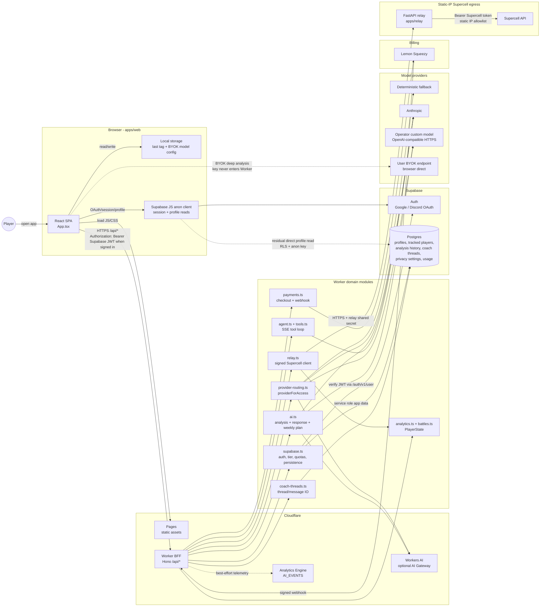
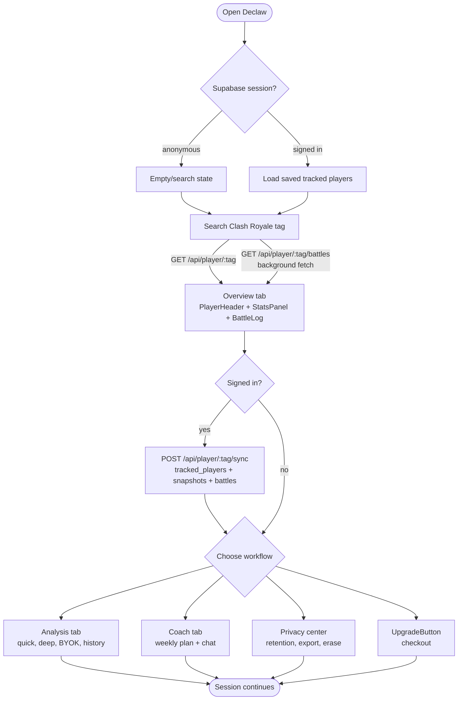
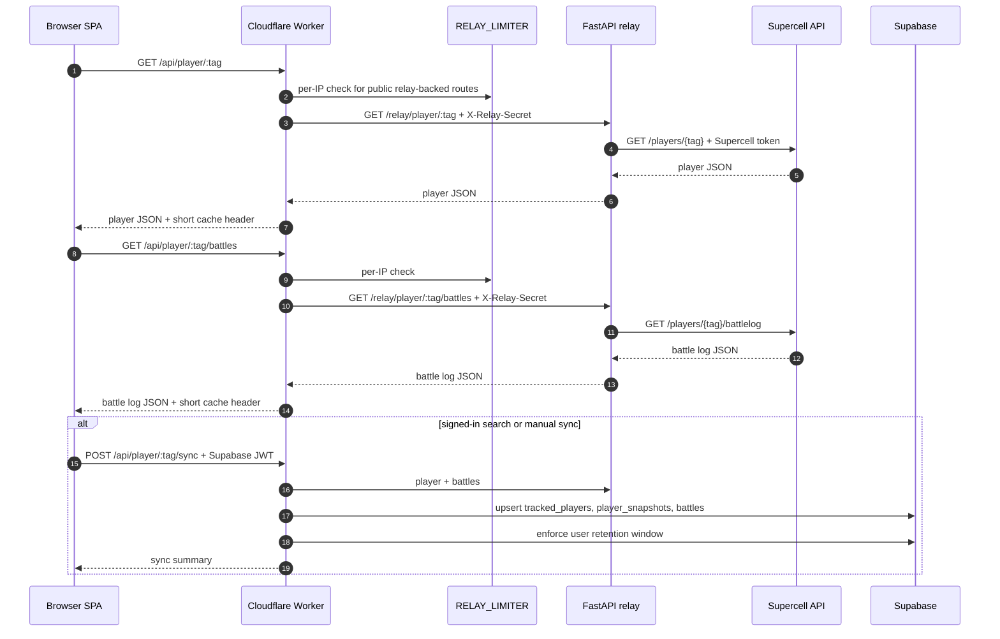
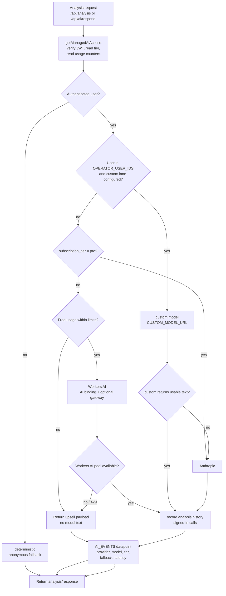
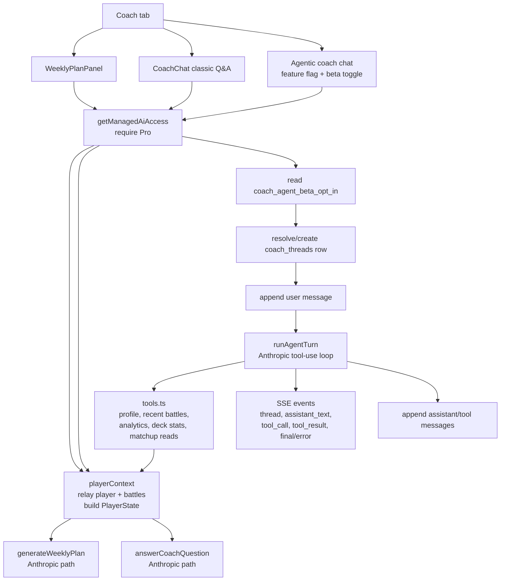
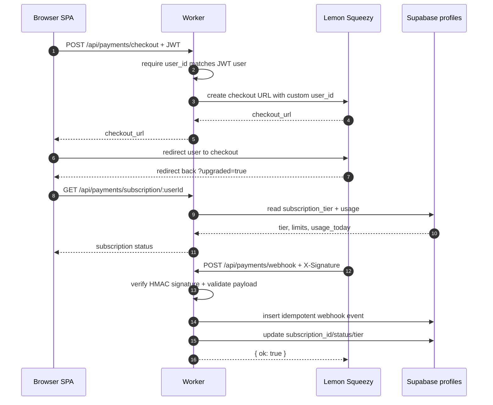
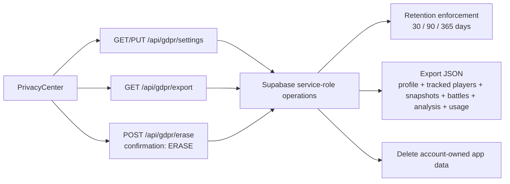

# CoachRoyale product flowgram

This flowgram is the code-derived operating map for the current app. It is
optimized for implementation reviews: product states, trust boundaries, backend
routes, provider gates, persistence points, and fallback behavior are all shown
in one place.

Rendered master diagram:
[generated-diagrams/coachroyale-flowgram-master.png](generated-diagrams/coachroyale-flowgram-master.png)

Review-ready diagram:
[generated-diagrams/coachroyale-flowgram-review.png](generated-diagrams/coachroyale-flowgram-review.png)

Workflow-canvas diagram:
[generated-diagrams/coachroyale-flowgram-workflow.png](generated-diagrams/coachroyale-flowgram-workflow.png)

Workflow-canvas diagram with icon labels:
[generated-diagrams/coachroyale-flowgram-workflow-labeled.png](generated-diagrams/coachroyale-flowgram-workflow-labeled.png)

Static workflow diagram:
[generated-diagrams/coachroyale-flowgram-workflow-static.png](generated-diagrams/coachroyale-flowgram-workflow-static.png)

SVG source:
[diagrams/coachroyale-flowgram-master.svg](diagrams/coachroyale-flowgram-master.svg)

Review SVG source:
[diagrams/coachroyale-flowgram-review.svg](diagrams/coachroyale-flowgram-review.svg)

Workflow SVG source:
[diagrams/coachroyale-flowgram-workflow.svg](diagrams/coachroyale-flowgram-workflow.svg)

Workflow labeled SVG source:
[diagrams/coachroyale-flowgram-workflow-labeled.svg](diagrams/coachroyale-flowgram-workflow-labeled.svg)

Static workflow SVG source:
[diagrams/coachroyale-flowgram-workflow-static.svg](diagrams/coachroyale-flowgram-workflow-static.svg)

Mermaid source:
[diagrams/coachroyale-flowgram-master.mmd](diagrams/coachroyale-flowgram-master.mmd)

Icon assets:
local SVG marks under `docs/architecture/diagrams/` are used for services with
recognizable vendor/runtime identities: React, Cloudflare, Supabase,
PostgreSQL, Anthropic, Lemon Squeezy, FastAPI, and Supercell. Internal Worker
modules, BYOK, and the operator custom model stay text-first because they do
not map to a single official service icon in this architecture.
The local marks were sourced as monochrome brand SVGs from Simple Icons for
stable offline rendering; brand and trademark rights remain with their owners.

## 1. Master flow

## 2. User journey flow

## 3. Supercell lookup and sync

## 4. Managed AI routing

This is the current runtime behavior for `/api/analysis` and
`/api/ai/respond`.

Provider selection priority:

| Priority | Condition | Provider |
|----------|-----------|----------|
| 1 | No authenticated user | `deterministic` |
| 2 | User id is in `OPERATOR_USER_IDS` and `CUSTOM_MODEL_URL`, `CUSTOM_MODEL_KEY`, `CUSTOM_MODEL_NAME` are set | `custom` |
| 3 | Authenticated user has `subscription_tier = pro` | `anthropic` |
| 4 | Authenticated free user | `workers_ai` |

Endpoint caveat: weekly plan, classic coach question, and agentic coach chat do
not call `providerForAccess` today. They are Pro-gated and use Anthropic-backed
generation paths.

## 5. Pro coaching flows

Agent chat properties:

| Property | Current behavior |
|----------|------------------|
| Route | `POST /api/coach/agent/:tag` |
| Transport | Server-sent events over HTTP |
| Eligibility | Authenticated Pro user plus `coach_agent_beta_opt_in = true` |
| Model | Anthropic tool-use loop |
| Tool boundary | Tools are scoped to the route player tag; the model cannot supply an arbitrary player tag |
| Persistence | `coach_threads` and immutable `coach_messages` |
| Abort behavior | Client disconnect aborts the Anthropic/tool loop |

## 6. Billing and entitlement

## 7. Privacy and data lifecycle

Privacy notes:

| Data | Storage / path |
|------|----------------|
| BYOK provider key | Browser local storage only; not sent to the Worker |
| Supabase anon key | Browser env only |
| Supabase service role | Worker only |
| Anthropic key | Worker only |
| Lemon webhook secret | Worker only |
| Relay shared secret | Worker and relay only |
| Supercell token | Relay only |

## 8. Route-to-feature matrix

| Feature | Browser surface | Worker route(s) | Main backend dependencies |
|---------|-----------------|-----------------|---------------------------|
| Player search | `SearchBar`, `PlayerHeader`, `StatsPanel` | `GET /api/player/:tag` | Relay -> Supercell |
| Battle log | `BattleLog` | `GET /api/player/:tag/battles` | Relay -> Supercell |
| Analytics | `PlayerAnalytics`, analysis prep | `GET /api/player/:tag/analytics` | Relay -> analytics module |
| Signed-in sync | search side effect, sync button | `POST /api/player/:tag/sync` | Relay -> Supabase |
| Quick AI | `AnalysisPanel` | `POST /api/ai/respond` | provider router, quotas, Analytics Engine |
| Deep AI | `AnalysisPanel` | `POST /api/analysis` | provider router, Relay, analytics, Analytics Engine |
| Browser BYOK | `ModelConfigPanel`, `AnalysisPanel` | none | user-supplied OpenAI-compatible URL |
| Analysis history | `AnalysisHistory` | `GET/POST /api/analysis-history` | Supabase |
| Weekly plan | `WeeklyPlanPanel` | `POST /api/coach/weekly-plan/:tag` | Pro gate, Relay, Anthropic |
| Classic coach Q&A | `CoachChat` | `POST /api/coach/question/:tag` | Pro gate, Relay, Anthropic |
| Agentic coach | `CoachChat` | `POST /api/coach/agent/:tag`, `GET/PUT /api/coach/agent-beta` | Pro + beta gate, Anthropic, tools, Supabase threads |
| Checkout | `UpgradeButton` | `POST /api/payments/checkout` | Lemon Squeezy |
| Subscription status | subscription provider | `GET /api/payments/subscription/:userId` | Supabase profiles |
| Billing webhook | external Lemon event | `POST /api/payments/webhook` | Lemon signature, Supabase profiles/events |
| Privacy controls | `PrivacyCenter` | `GET/PUT /api/gdpr/settings`, `GET /api/gdpr/export`, `POST /api/gdpr/erase` | Supabase |

## 9. Review checklist

Use this list when changing the product flow:

| Check | Question |
|-------|----------|
| Trust boundary | Did any browser path start receiving a service-role, Anthropic, Lemon, relay, or Supercell secret? |
| BYOK | Does BYOK still go browser-to-provider without Worker proxying? |
| Auth | Does the Worker verify user identity before any user-scoped read/write? |
| Entitlement | Are Pro-only routes gated before cache shortcuts or expensive work? |
| Provider routing | If a route should use managed routing, does it call `providerForAccess`? |
| Fallback | Are custom-lane failures observable and non-fatal where intended? |
| Persistence | Are user messages/results written only after validation and scoped by user id? |
| Observability | Is `X-Request-ID` propagated and is AI telemetry best-effort only? |
| Retention | Does new user-owned data participate in export, erasure, and retention policy? |

## 10. Revision history

| Date | Change |
|------|--------|
| 2026-05-19 | Initial code-derived product flowgram. |
