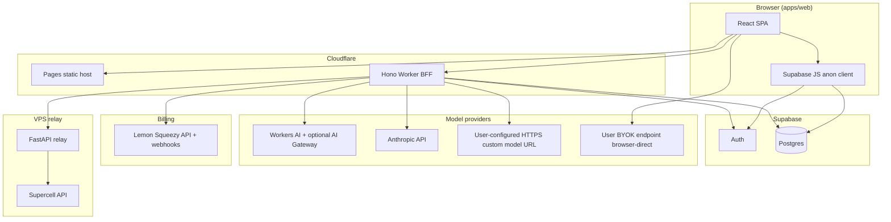

# Code-derived architecture audit (May 2026)

This document is **generated from the repository source** (primarily `apps/api-worker/src`, `apps/web/src`, `apps/relay/app`) as of the audit date. It does **not** reuse or trace the existing PNG under `docs/architecture/generated-diagrams/`; that asset may still be useful for slides but can drift from code.

**Audit method:** read Worker entry (`index.ts`), provider routing (`provider-routing.ts`, `ai.ts`), web BFF client (`api.ts`), relay (`main.py`), env/bindings (`types.ts`, `wrangler.toml`).

---

## 1. Executive summary

| Area | Docs / prior assumption | What the code actually does |
|------|-------------------------|-----------------------------|
| Managed AI lanes | Three named lanes (`free`, `sft`, `byok`) in design docs | Runtime types use `deterministic`, `workers_ai`, `anthropic`, `custom`. There is **no** string literal `sft` in the Worker routing path—**`custom`** is the self-hosted / operator lane. |
| Who gets which provider | Broad “pro → premium model” | `providerForAccess()` (`provider-routing.ts`): anonymous → `deterministic`; else if user id ∈ `OPERATOR_USER_IDS` **and** `CUSTOM_MODEL_*` env set → `custom`; else `pro` → `anthropic`, `free` → `workers_ai`. |
| Endpoints using full router | “All Pro AI” | **`/api/analysis`** and **`/api/ai/respond`** call `providerForAccess` and pass `provider` into `ai.ts`. **`/api/coach/weekly-plan`**, **`/api/coach/question`**, and the **agentic SSE** path do **not** pass `provider`; they effectively use **Anthropic-only** paths (plus deterministic fallbacks where implemented). |
| Agentic chat | Same as other Pro lanes | **`/api/coach/agent/:tag`** is **Anthropic tool-use only** (see `lib/agent.ts`, comments in `index.ts`). Custom lane integration is explicitly deferred (comment references roadmap). |
| BYOK / user model keys | Browser-direct BYOK | **`fetchCustomModelAnalysis`** in `apps/web/src/lib/api.ts` calls the user’s OpenAI-compatible URL **from the browser** with keys from client config (`AnalysisPanel.tsx`). Keys are **not** sent to the Worker on that path. |
| Sentry | (not in older arch README) | **`apps/api-worker/src/lib/sentry.ts`** exists with `buildSentryConfig` / `captureWorkerError`, but **nothing imports it** from `index.ts` yet—**dead code** until wired; `Env` in `types.ts` has no `SENTRY_DSN` field. |
| Telemetry | — | Worker writes **Analytics Engine** via `AI_EVENTS` binding (`wrangler.toml`) for managed AI usage and coach-agent turns. |

---

## 2. Active deployable components

| Component | Path | Role |
|-----------|------|------|
| Web SPA | `apps/web` | Vite + React; default API base `https://relay.coach-royale.com/api` (override `VITE_API_BASE_URL`); Supabase anon client for auth + **direct `profiles` read** (`lib/profile.ts`). |
| BFF | `apps/api-worker` | Hono on Cloudflare Worker; `[ai]` binding `AI`; `AI_EVENTS` dataset; CORS from `ALLOWED_ORIGINS`. |
| Relay | `apps/relay` | FastAPI; `/relay/*` JSON proxies to Supercell; shared-secret auth; `/health`, `/ready`. |
| Schema / auth backend | `supabase` | Migrations + Postgres; Worker uses service role + REST admin where needed. |

Legacy trees (`coachroyale`, `prototype`, `pipeline`, `history`) are explicitly out of scope per root `README.md`.

---

## 3. Worker HTTP surface (authoritative list)

Derived from `app.*` registrations in `apps/api-worker/src/index.ts`:

| Method | Path | Notes |
|--------|------|--------|
| GET | `/api/health` | Liveness |
| GET | `/api/ready` | Config readiness matrix (origins, AI gateway, Lemon, relay, Supabase, Workers AI binding, etc.) |
| GET | `/api/player/:tag` | Relay-backed, cache headers |
| GET | `/api/player/:tag/battles` | Relay |
| GET | `/api/player/:tag/chests` | Relay |
| GET | `/api/player/:tag/analytics` | Relay + analytics |
| GET | `/api/clan/:tag` | Relay |
| GET | `/api/cards` | Relay |
| POST | `/api/player/:tag/sync` | Persist via Supabase when authorized |
| POST | `/api/analysis` | **Managed routing** (`providerForAccess`) |
| POST | `/api/ai/respond` | **Managed routing** + free-tier daily pool + upsell payloads |
| POST | `/api/coach/weekly-plan/:tag` | Pro only; **no** `provider` passed → Anthropic path in `generateWeeklyPlan` |
| POST | `/api/coach/question/:tag` | Pro only; **no** `provider` → `answerCoachQuestion` uses Anthropic (custom branch only if `options.provider === "custom"`, never set here) |
| POST | `/api/coach/agent/:tag` | Pro + beta opt-in; SSE; **Anthropic agent loop only** |
| POST | `/api/payments/checkout` | Lemon Squeezy |
| GET | `/api/payments/subscription/:userId` | |
| POST | `/api/payments/webhook` | Lemon webhook |
| GET/DELETE | `/api/tracked-players`, `/api/tracked-players/:id` | |
| GET/POST | `/api/analysis-history` | |
| GET/PUT | `/api/gdpr/settings` | |
| GET/POST | `/api/gdpr/export`, `/api/gdpr/erase` | |
| GET/PUT | `/api/coach/agent-beta` | Pro beta opt-in (AG7) |

---

## 4. Managed AI provider selection (code)

Source: `providerForAccess` / `modelForProvider` in `apps/api-worker/src/lib/provider-routing.ts`, invoked from `index.ts` for **`runManagedDeepAnalysis`** and **`/api/ai/respond`**.

Priority:

1. No authenticated user → `deterministic`
2. User in `OPERATOR_USER_IDS` **and** `CUSTOM_MODEL_URL` + `CUSTOM_MODEL_KEY` + `CUSTOM_MODEL_NAME` → `custom`
3. Else subscription tier `pro` → `anthropic`
4. Else → `workers_ai`

**Custom lane behavior** (`ai.ts`): OpenAI-compatible `POST …/chat/completions`; optional header `X-Custom-Model-Auth` from `CUSTOM_MODEL_SHARED_SECRET`. Any failure returns `null` and callers use **Anthropic fallback** (for `custom` routing in analysis/respond/generation paths that wire `customWithAnthropicFallback` or equivalent).

**Workers AI:** uses `env.AI.run` with optional **AI Gateway** when `AI_GATEWAY_ID` is set (`wrangler.toml` default `coachroyale-free`).

---

## 5. Stale or misleading documentation (actionable)

| Document | Issue |
|----------|--------|
| `docs/architecture/model-routing.md` | Describes `sft` lane and “garage behind Cloudflare Tunnel” as the product abstraction. Code implements **`custom`** with env-gated URL (could be tunnel, funnel, or any HTTPS origin). Naming and routing matrix should be aligned or the doc should state “`sft` ≡ `custom` in code”. |
| Same | States recommended routing for **all** premium experiences. **Weekly plan, coach Q&A, and agent chat** do not use `providerForAccess` today—operators using the custom lane still get Anthropic on those endpoints unless code is changed. |
| `docs/architecture/README.md` | High-level flow remains valid; **AI lane** bullet should cross-link to this audit or be updated with the endpoint-level table in §3. |
| Root `README.md` | AI lanes line mentions `sft` → garage; should match **`custom`** + operator gate or be clarified as design alias. |

---

## 6. Architecture diagram (code-derived, Mermaid)

Edges reflect **actual** call paths found in code (not the PNG layout).

**Legend**

- **CUST**: Worker-originated `fetch` to `CUSTOM_MODEL_URL` (operator / custom lane), not the same code path as **BYOK** (`fetchCustomModelAnalysis`).

---

## 7. Follow-ups (optional beads / PRs)

1. Align `model-routing.md` and root README lane vocabulary with `provider-routing.ts` (`custom` vs `sft`) and document **per-endpoint** provider behavior.
2. Either pass `provider` from `providerForAccess` into weekly plan / coach question / (later) agent, or document intentionally Anthropic-only scope.
3. Wire `sentry.ts` into `Env` + `wrangler` secrets and `index.ts` error hooks, or remove unused module.
4. Regenerate or replace `coachroyale-cf-bff-architecture.png` using this audit as the source of truth.

---

## 8. Revision history

| Date | Author | Change |
|------|--------|--------|
| 2026-05-03 | Code audit | Initial code-derived pass |
