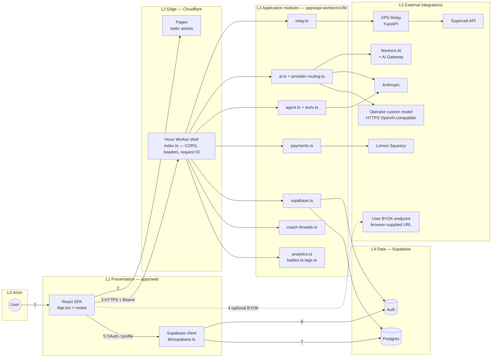

# Layered architecture (AWS-style) and software modules

This document explains **how to produce best-in-class architecture diagrams** for this workload (multi-vendor: Cloudflare, Supabase, Anthropic, Lemon Squeezy, VPS relay), maps the **canonical layers and request flows** in a way that aligns with **AWS architecture diagramming discipline**, and lists **every software module** in the active `apps/*` surface with its responsibility.

The earlier Mermaid-only figure in `code-derived-architecture-audit-2026-05.md` was optimized for code truth, not for stakeholder review. Use **this** document when you need AWS-style structure, legends, and module ownership.

---

## 1. What “AWS-aligned” means for a non-AWS workload

Amazon’s guidance treats architecture diagramming as a way to show **components**, **data movement**, and **environment interaction** with consistent layout and notation ([What is architecture diagramming?](https://aws.amazon.com/what-is/architecture-diagramming/)). The **AWS Architecture Icons** and **Security Reference Architecture** layout habits (modular tiers, left-to-right or top-to-bottom flow, legend) are the usual bar for “Well-Architected” reviews—even when the underlying services are not AWS.

**Adaptation for CoachRoyale:**

| AWS habit | How we apply it here |
|-----------|----------------------|
| Use official **service icons** and names | Replace AWS services with **Cloudflare**, **Supabase**, **Anthropic**, etc., using [AWS Architecture Icons](https://aws.amazon.com/architecture/icons/) only where an AWS service appears (none today), or vendor kits (e.g. Cloudflare brand assets, Supabase) in draw.io / Figma. |
| **Layered** presentation → business → data | Map to **Presentation (browser)** → **Edge (Pages + Worker)** → **Application (Worker libraries)** → **Data (Supabase)** → **External integrations** (AI, billing, Supercell). |
| **Trust boundaries** | Draw a clear boundary around the **browser**, around **Cloudflare**, and between **Worker** and **relay** (shared secret) and **Supabase** (service role vs user JWT). |
| **Label edges** with protocol and purpose | e.g. `HTTPS + Bearer (Supabase JWT)`, `HTTPS + relay secret`, `wss` not used—SSE is `text/event-stream` over HTTP. |
| **Solid vs dashed** | **Solid**: synchronous request/response on the hot path. **Dashed**: optional path, fallback, or browser-only BYOK that bypasses the Worker. |
| **Single primary reading direction** | **Left → right** = user toward external systems (industry default for integration diagrams). |

**Well-Architected lens (diagram checklist):** When you finalize a diagram for design review, annotate which areas support **Security** (auth paths, secrets), **Reliability** (fallback AI, health/ready), **Operational Excellence** (request IDs, structured logs, Analytics Engine), **Cost Optimization** (Workers AI free lane, quotas), and **Performance** (relay cache headers). You do not need six copies of the diagram—one base diagram plus a short table is enough.

---

## 2. Recommended ways to build the “gold” diagram

| Approach | AWS / enterprise fit | Notes |
|----------|----------------------|--------|
| **draw.io (diagrams.net)** + **AWS Architecture Icons** + vendor logos | Excellent | Manual but fastest for polished reviews. Use a **single canvas**, **snap to grid**, **one direction**, export PNG/SVG for `docs/architecture/generated-diagrams/`. |
| **Structurizr / C4-PlantUML** | Excellent for **software modules** | Model **containers** (web, worker, relay, Supabase) and **components** (map 1:1 to `lib/*.ts` below). Export PNG from CI or locally. |
| **Python `diagrams`** ([mingrammer/diagrams](https://github.com/mingrammer/diagrams)) | Good for AWS-heavy stacks; hybrid for CF | Programmatic; limited Cloudflare nodes—often use generic “compute” + labeled box. |
| **Mermaid** (`flowchart LR` + subgraphs) | Good for **GitHub-native** docs | Weak iconography; strong for **version-controlled** drafts. Use **edge labels** and **legends** (below). |
| **Workload Discovery on AWS** | N/A today | Useful only if you later deploy AWS resources ([AWS documentation](https://docs.aws.amazon.com/solutions/workload-discovery-on-aws/)). |

**Practical recommendation for this repo:** Maintain **C4 Level 2 (containers)** in Structurizr or draw.io as the reviewer-facing artifact, and keep **Mermaid + module tables** in Git for drift detection. Regenerate the PNG when containers change.

### 2.1 Netflix / Uber–style visuals (color, stroke weight, vendor truth)

Netflix and Uber do **not** publish one downloadable “diagram standard,” but their public architecture figures (tech blog, conference decks) share traits that reviewers expect from **tier‑1 platform engineering**:

| Pattern | How it shows up in their material | How we applied it |
|--------|-----------------------------------|-------------------|
| **Hue = domain** | Distinct palettes for playback vs metadata vs data stores (Netflix-style “pipe” diagrams) vs mesh / RPC domains (Uber) | Orange = Cloudflare edge + Worker hot path; green = Supabase; purple = Anthropic; teal = operator HTTPS model; yellow = billing; pink = relay egress; indigo dashed = BYOK. |
| **Stroke width = salience** | Hot RPC paths drawn heavier than auxiliary calls | Thickest stroke = browser → Worker (primary BFF); thinner strokes for billing, relay, secondary vendor hops. |
| **Control vs delivery** | Separate concerns (e.g., Netflix control plane vs Open Connect delivery) | Static **Pages** path (cyan) vs **API** path (orange) vs **data** (green). |
| **Vendor nesting** | Managed services sit inside the provider boundary that operates them | **Workers AI** sits **inside** the Cloudflare boundary: it is **not** a third-party box next to “Cloudflare”—the Worker invokes inference through the **`AI` binding** (`env.AI.run` in `apps/api-worker/src/lib/ai.ts`), on Cloudflare’s stack, optionally via **AI Gateway**. |

**Stakeholder diagram (recommended):** open [`diagrams/layered-architecture-colored.html`](diagrams/layered-architecture-colored.html) — dark canvas, **official Cloudflare logo** (Wikimedia Commons SVG), **variable‑color and variable‑width edges**, legend, and explicit **Workers AI** nesting. The monochrome Mermaid in §4 remains the **diff‑friendly** fallback for Git review.

---

## 3. Canonical layers (west → east)

| # | Layer | Contains | Trust notes |
|---|--------|----------|-------------|
| L0 | **Actor** | End user | Controls browser; BYOK keys live here only. |
| L1 | **Presentation** | React SPA (`apps/web`) | Loads from Pages; holds Supabase session; may call BYOK URLs directly. |
| L2 | **Edge & API gateway** | Cloudflare Pages + Worker (`index.ts` HTTP surface) | CORS allowlist, security headers, HSTS, `X-Request-ID`. |
| L3 | **Application / domain** | Worker `lib/*` modules | Business rules, orchestration, quotas, AI routing. |
| L4 | **Data** | Supabase Auth + Postgres | RLS for user-scoped reads; service role for BFF writes. |
| L5 | **External systems** | Workers AI (+ optional AI Gateway), Anthropic, custom HTTPS model, Lemon Squeezy, Relay→Supercell | Third-party and static-IP egress. |

---

## 4. Reference diagram (Mermaid, AWS-style layout)

**Legend**

- **Solid arrow** — synchronous HTTP on the primary product path.
- **Dashed arrow** — path that bypasses the Worker or is optional / secondary.
- Numbers — request **flows** described in §5.



*Limitations:* Mermaid cannot render official vendor icons, **color / variable stroke weight**, or a faithful **parent–child** layout for **Workers AI** (it is peer to the Worker here). For board-ready and Netflix/Uber–style review diagrams, use [`diagrams/layered-architecture-colored.html`](diagrams/layered-architecture-colored.html) or redraw in draw.io with vendor asset packs.

---

## 5. Numbered flows (for legend on the formal diagram)

| ID | Name | Path |
|----|------|------|
| 1 | User opens product | User → SPA |
| 2 | Static UI delivery | SPA loads JS/CSS from Pages |
| 3 | Authenticated BFF API | SPA → Worker with `Authorization: Bearer` (Supabase JWT) |
| 4 | BYOK analysis (optional) | Browser → user BYOK endpoint (`lib/api.ts` `fetchCustomModelAnalysis`) — **Worker does not see the key** |
| 5 | Session + profile | SPA uses anon Supabase client for **OAuth session** and `lib/profile.ts` reads `profiles` with RLS. |
| 5a | **Google / Discord sign-in** | `apps/web/src/auth/AuthProvider.tsx` → `supabase.auth.signInWithOAuth` with `provider: 'google'` or `'discord'`. The **browser** opens Supabase’s authorize URL; Supabase **brokers** OAuth/OIDC to **Google** or **Discord** (user follows HTTP redirects in the same tab); tokens return via Supabase to the SPA. **The Worker BFF is not on this path.** |

**Worker-internal (after flow 3):** Routes in `index.ts` delegate to `relay.ts` (Supercell-shaped JSON), `supabase.ts` (persistence and access checks), `ai.ts` / `provider-routing.ts` (managed model selection), `agent.ts` / `tools.ts` (Pro agent SSE), `payments.ts` (checkout + webhook), `coach-threads.ts` (threads/messages), `analytics.ts` / `battles.ts` / `tags.ts` (normalization and stats).

---

## 6. Software modules — `apps/api-worker` (authoritative)

| Module (`src/lib/` or root) | Responsibility |
|----------------------------|----------------|
| **`index.ts`** | Hono app: global middleware (request ID, CORS, security headers), all `/api/*` routes, readiness, orchestrates calls into libraries. |
| **`types.ts`** | `Env` bindings and shared DTO types for routes and libs. |
| **`relay.ts`** | Signed HTTP client to VPS relay (`RELAY_BASE_URL` + secret); player, battles, chests, clan, cards. |
| **`supabase.ts`** | Service-role and user-context Supabase access: profiles, subscriptions, privacy, GDPR, sync persistence, free AI counters, coach agent beta flag, coach threads helpers used by routes. |
| **`provider-routing.ts`** | Pure routing: `providerForAccess`, `modelForProvider`, operator/custom gate. |
| **`ai.ts`** | Managed text generation: Anthropic, Workers AI (+ gateway), custom OpenAI-compatible lane + fallbacks; coach question text; weekly plan JSON; quick/deep analysis helpers. |
| **`agent.ts`** | Anthropic multi-turn tool loop for agentic coach; streams events to SSE consumer. |
| **`tools.ts`** | Tool implementations the agent can call (relay, analytics, Supabase-backed reads, etc.). |
| **`coach-threads.ts`** | Coach thread/message persistence shape for agent routes. |
| **`payments.ts`** | Lemon Squeezy checkout URL + webhook verification + subscription mapping helpers. |
| **`battles.ts`** | Normalize relay battle JSON to internal battle model. |
| **`analytics.ts`** | Derive `PlayerState` and summaries from battles. |
| **`tags.ts`** | Player tag normalization. |
| **`api-errors.ts`** | Structured JSON error envelope with `request_id`. |
| **`http.ts`** | Small HTTP helpers if present (shared fetch patterns). |
| **`sentry.ts`** | Optional error reporting scaffold (**not wired** from `index.ts` as of audit). |

---

## 7. Software modules — `apps/web`

| Area | Path | Responsibility |
|------|------|----------------|
| Shell | `App.tsx`, `main.tsx` | Routing/layout, providers. |
| Auth | `auth/AuthProvider.tsx`, `auth/context.tsx`, `auth/SubscriptionProvider.tsx`, `lib/auth.ts` | OAuth, session, subscription context. |
| API client | `lib/api.ts` | All Worker `fetch` calls + SSE parser for coach agent + BYOK `fetchCustomModelAnalysis`. |
| Supabase | `lib/supabase.ts`, `lib/supabaseConfig.ts` | Anon client and env validation. |
| Profile | `lib/profile.ts` | Direct `profiles` read via Supabase client. |
| Model / BYOK | `lib/modelConfig.ts`, `components/ModelConfigPanel.tsx` | Local storage model config for browser-direct calls. |
| Feature UI | `components/AnalysisPanel.tsx`, `CoachChat.tsx`, `WeeklyPlan.tsx`, `BattleLog.tsx`, `PlayerAnalytics.tsx`, `PrivacyCenter.tsx`, `TrackedPlayers.tsx`, … | Product screens wired to `lib/api.ts` or Supabase. |
| Hooks | `hooks/useAuth.ts`, `hooks/useSubscription.ts` | Client-side state. |
| UI primitives | `components/ui/*` | Shared components. |

---

## 8. Software modules — `apps/relay`

| Module | Responsibility |
|--------|----------------|
| **`app/main.py`** | FastAPI app, middleware (request ID, structured logs), `/health`, `/ready`, `/relay/*` routes. |
| **`app/security.py`** | Shared-secret gate for Worker → relay. |
| **`app/config.py`** | Environment settings. |
| **`app/supercell.py`** | Upstream Supercell HTTP calls. |

---

## 9. Local preview

**diagrams.net / draw.io (editable — recommended for slides):**

```bash
open docs/architecture/diagrams/coachroyale-architecture.drawio
```

Opens in [diagrams.net](https://app.diagrams.net/) (drag file in browser) or VS Code draw.io extension.

**Colored SVG (Netflix / Uber–style — quick browser view):**

```bash
open docs/architecture/diagrams/layered-architecture-colored.html
```

**Monochrome Mermaid (same topology as §4, Git-friendly):**

```bash
open docs/architecture/diagrams/layered-architecture-preview.html
```

---

## 10. Revision history

| Date | Change |
|------|--------|
| 2026-05-03 | Initial AWS-aligned layered doc + module inventory + preview HTML. |
| 2026-05-03 | Added colored SVG diagram, Cloudflare logo, nested Workers AI, §2.1 visual-language notes. |
| 2026-05-03 | Colored diagram: Google + Discord IdPs, Supabase broker edges, OAuth redirect arcs; §5 flow 5a. |
| 2026-05-03 | Added `diagrams/coachroyale-architecture.drawio` for diagrams.net editing. |
